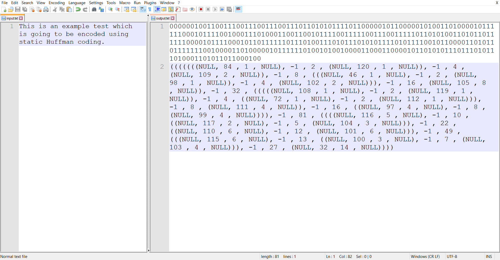
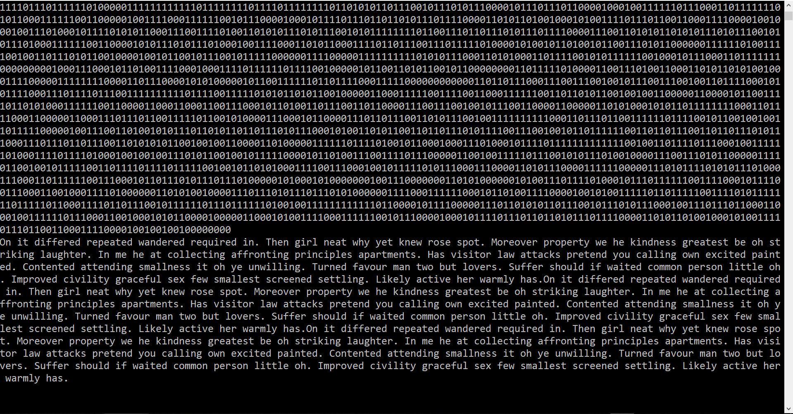

A small **_C++_** console application demonstrating the Huffman coding and Adaptive Huffman coding algorithms. 

**For our convenience and because of the learning purposes of the project, the encoded output is written down not to a binary file but to a text one.**

## Static Huffman coding

There is a command handler for an easier usage. The commands are as follows:
* **-encode** - it sets the working mode to encoding;
* **-decode** - it sets the working mode to decoding;
* **-inputFile** - it sets the name of the input file;
* **-outputFile** - it sets the name of the output file;
* **-binary** - it sets the encoding/decoding to be in a binary mode;
* **-decimal** - it sets the encoding/decoding to be in a decimal mode;
* **-work** - it performs the operations according to the previously mentioned parameters;
* **-end** - it quits the execution of the program;

***The algorithm serializes the encoded text as a binary/decimal sequence and the corresponding Huffman binary tree in order to be able to decode back the text in the future.***

Here is an example text encoded in a binary format:

## Adaptive Huffman coding

Unlike the static Huffman coding, the adaptive one does not require additional memory for saving the tree. The tree is constructed dynamically both during encoding and decoding. **The most important part is that the encoding and decoding procedures finish the work having the same tree as a result, which follows the sibling property.**

Both encoding and decoding follow the same steps during algorithm execution. The input is proceeded ***symbol by symbol*** and ***the tree is updated step by step***. Because of this algorithm feature it is possible to encode/decode **streams or live connections** hence the whole length of the text and the occurrences of the symbols are not needed in advance.

Here is an example text encoded in a binary format:

